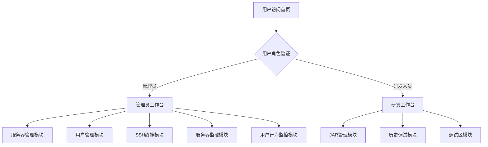

# 首页工作台重新设计方案

## 1. 概述

### 1.1 项目背景
本项目是为后端开发团队设计的轻量级Web平台，旨在简化在共享开发服务器上的部署与调试流程。当前首页设计为通用型工作台，未根据用户角色进行差异化展示，导致研发人员需要关注与自身工作无关的服务器管理等功能。

### 1.2 设计目标
根据用户角色（管理员和研发）提供不同的工作台体验：
- 管理员工作台：服务器管理、用户管理、SSH终端、服务器监控、用户行为监控
- 研发工作台：JAR管理、历史调试、调试区

### 1.3 技术栈
- 后端：Spring Boot 3.x
- 前端：Thymeleaf模板引擎
- 安全：Spring Security
- 数据库：H2内嵌数据库
- 实时通信：WebSocket

## 2. 架构设计

### 2.1 系统架构
采用MVC架构模式，通过Spring Security进行角色权限控制，根据用户角色展示不同的首页内容。



### 2.2 角色权限体系
系统定义三种核心角色：
- SUPER_ADMIN：超级管理员，拥有所有权限
- ADMIN：管理员，可管理服务器和用户
- USER：普通用户（研发人员），仅能访问应用管理相关功能

权限控制通过Spring Security实现：
- URL访问控制：通过`http.authorizeRequests()`方法定义不同URL路径的访问权限
- 方法级别权限：使用`@PreAuthorize`注解进行细粒度控制

## 3. 功能模块设计

### 3.1 管理员工作台

#### 3.1.1 服务器管理
功能描述：管理服务器列表和工作目录配置
- 添加/编辑/删除服务器
- SSH连接配置与测试
- 服务器状态查看

#### 3.1.2 用户管理
功能描述：管理用户权限和角色分配
- 用户增删改查
- 角色分配与权限控制
- 用户状态管理（启用/禁用）

#### 3.1.3 SSH终端
功能描述：远程连接服务器，支持多标签页终端管理
- 多标签页SSH终端
- 完善的命令输入体验
- 实时会话管理

#### 3.1.4 服务器监控
功能描述：实时查看服务器状态和系统监控
- CPU、内存、磁盘使用率监控
- 网络状态监控
- 应用运行状态监控

#### 3.1.5 用户行为监控
功能描述：监控用户在服务器上的活动情况
- 活跃用户统计
- 用户操作记录
- 会话管理

### 3.2 研发工作台

#### 3.2.1 JAR管理
功能描述：上传、启动、停止和管理Java应用程序
- JAR包上传与管理
- 应用生命周期控制（启动/停止/重启）
- 端口自动分配与冲突避免

#### 3.2.2 历史调试
功能描述：查看历史调试记录和应用状态
- 应用运行历史记录
- 调试日志查看
- 应用状态变更追踪

#### 3.2.3 调试区
功能描述：提供调试友好的功能区域
- 实时日志查看
- 应用监控面板
- 快速操作入口

## 4. 前端界面设计

### 4.1 页面结构
首页将根据用户角色展示不同的工作台界面：

#### 4.1.1 管理员工作台布局
```
+-------------------------------------------------------------+
| 品牌标识                         用户信息 | 主题切换 | 登出 |
+-------------------------------------------------------------+
| 服务器管理 | 用户管理 | SSH终端 | 服务器监控 | 用户行为监控 |
+-------------------------------------------------------------+
|                                                             |
|                    服务器状态总览面板                       |
|                                                             |
+-------------------------------------------------------------+
|                                                             |
|                      最近活动时间线                         |
|                                                             |
+-------------------------------------------------------------+
|                                                             |
|                        快捷操作区                           |
|                                                             |
+-------------------------------------------------------------+
```

#### 4.1.2 研发工作台布局
```
+-------------------------------------------------------------+
| 品牌标识                         用户信息 | 主题切换 | 登出 |
+-------------------------------------------------------------+
| JAR管理 | 历史调试 | 调试区 | 应用监控 | 日志查看           |
+-------------------------------------------------------------+
|                                                             |
|                     应用状态总览面板                        |
|                                                             |
+-------------------------------------------------------------+
|                                                             |
|                      最近调试时间线                         |
|                                                             |
+-------------------------------------------------------------+
|                                                             |
|                        快捷操作区                           |
|                                                             |
+-------------------------------------------------------------+
```

### 4.2 组件设计

#### 4.2.1 导航菜单组件
根据用户角色动态渲染不同的导航菜单项：
- 管理员：服务器管理、用户管理、SSH终端、服务器监控、用户行为监控
- 研发人员：JAR管理、历史调试、调试区

#### 4.2.2 状态面板组件
展示与角色相关的关键指标：
- 管理员：服务器状态、资源使用率、活跃用户数
- 研发人员：应用状态、调试会话数、资源使用情况

#### 4.2.3 活动时间线组件
展示与角色相关的最近活动记录：
- 管理员：服务器操作记录、用户活动记录
- 研发人员：应用操作记录、调试活动记录

#### 4.2.4 快捷操作组件
提供与角色相关的常用操作快捷入口：
- 管理员：添加服务器、创建用户、连接SSH终端
- 研发人员：上传JAR包、启动应用、查看日志

## 5. 后端接口设计

### 5.1 控制器层
创建角色特定的控制器来处理不同工作台的请求：

#### 5.1.1 AdminDashboardController
处理管理员工作台相关请求：
- 获取服务器状态数据
- 获取用户活动统计数据
- 获取系统监控指标

#### 5.1.2 DeveloperDashboardController
处理研发工作台相关请求：
- 获取应用状态数据
- 获取调试历史记录
- 获取应用监控数据

### 5.2 服务层
在服务层实现角色特定的业务逻辑：

#### 5.2.1 DashboardService
提供工作台数据聚合服务：
- 根据用户角色聚合相应的数据
- 处理数据格式化和权限验证

### 5.3 数据模型
创建专门的工作台数据传输对象：

#### 5.3.1 AdminDashboardDto
管理员工作台数据模型：
- 服务器状态列表
- 用户活动统计数据
- 系统监控指标

#### 5.3.2 DeveloperDashboardDto
研发工作台数据模型：
- 应用状态列表
- 调试历史记录
- 应用监控数据

## 6. 安全设计

### 6.1 访问控制
通过Spring Security实现基于角色的访问控制：
- 管理员工作台URL仅允许ADMIN和SUPER_ADMIN角色访问
- 研发工作台URL仅允许USER角色访问

### 6.2 数据隔离
确保用户只能访问与其角色相关的数据：
- 管理员可查看所有服务器和用户数据
- 研发人员仅能查看自己的应用和调试数据

### 6.3 权限验证
在控制器和服务层添加权限验证注解：
- 使用`@PreAuthorize`注解进行方法级别权限控制
- 在服务层实现业务逻辑相关的安全检查

## 7. 测试策略

### 7.1 单元测试
为各服务类编写单元测试：
- 验证角色权限控制逻辑
- 测试数据聚合功能
- 验证异常处理机制

### 7.2 集成测试
编写集成测试验证完整功能：
- 测试不同角色用户访问工作台的正确性
- 验证数据隔离机制
- 测试权限控制的有效性

### 7.3 界面测试
验证前端界面根据不同角色正确渲染：
- 管理员用户应看到管理员工作台
- 研发用户应看到研发工作台
- 验证各组件正确显示相应数据