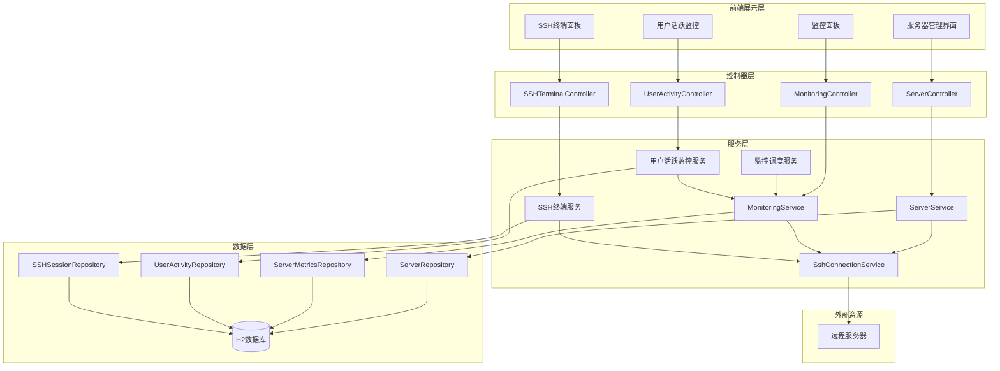
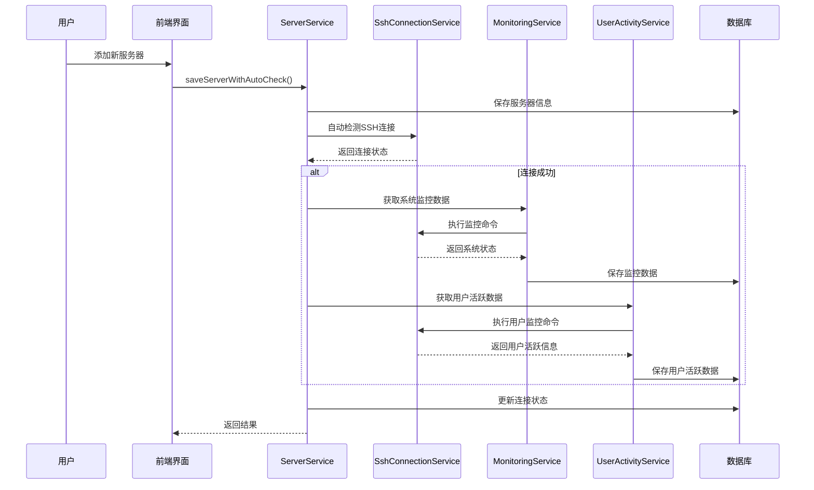

# 服务器连接监控系统设计

## 1. 概述

### 1.1 核心功能
- 服务器添加后自动SSH连接检测
- 实时SSH连接状态监控
- 系统资源状态展示（CPU、内存、硬盘）
- 用户活跃监控和行为分析
- 多标签页SSH终端（参考SecureCRT/Tabby）
- WebSocket实时通信
- 连接状态可视化界面

### 1.2 技术栈
- **后端框架**: Spring Boot 3.x
- **SSH连接**: JSch库  
- **数据库**: H2/SQLite (JPA)
- **前端模板**: Thymeleaf + xterm.js
- **实时通信**: WebSocket + 定时轮询
- **终端模拟**: xterm.js + node-pty

## 2. 系统架构

### 2.1 架构图



### 2.2 业务流程



## 3. 数据模型设计

### 3.1 Server实体增强

```java
@Entity
public class Server {
    // 现有字段...
    
    @Enumerated(EnumType.STRING)
    private ConnectionStatus connectionStatus = ConnectionStatus.UNKNOWN;
    
    private LocalDateTime lastConnectionCheck;
    private LocalDateTime lastMetricsUpdate;
    private Boolean autoMonitorEnabled = true;
    private Integer monitorIntervalSeconds = 60;
    
    public enum ConnectionStatus {
        UNKNOWN("未知"),
        CONNECTED("连接成功"), 
        FAILED("连接失败"),
        TIMEOUT("连接超时"),
        AUTH_FAILED("认证失败"),
        MONITORING("监控中");
    }
}
```

### 3.2 ServerMetrics实体

```java
@Entity
public class ServerMetrics {
    @Id
    @GeneratedValue(strategy = GenerationType.IDENTITY)
    private Long id;
    
    private Long serverId;
    private String serverName;
    private String hostname;
    
    // CPU信息
    private Double cpuUsage;
    private Integer cpuCores;
    private String loadAverage;
    
    // 内存信息
    private Long memoryTotal;
    private Long memoryUsed;
    private Long memoryAvailable;
    private Double memoryUsage;
    
    // 磁盘信息
    private Long diskTotal;
    private Long diskUsed;
    private Long diskAvailable;
    private Double diskUsage;
    
    // 系统信息
    private String uptime;
    private String osVersion;
    private LocalDateTime timestamp;
    private Long collectionDurationMs;
}
```

### 3.3 UserActivity实体（新增）

```java
@Entity
@Table(name = "user_activities")
public class UserActivity {
    @Id
    @GeneratedValue(strategy = GenerationType.IDENTITY)
    private Long id;
    
    @Column(name = "server_id", nullable = false)
    private Long serverId;
    
    @Column(name = "username")
    private String username;
    
    @Column(name = "user_id")
    private String userId;
    
    @Column(name = "session_id")
    private String sessionId;
    
    @Column(name = "login_time")
    private LocalDateTime loginTime;
    
    @Column(name = "logout_time")
    private LocalDateTime logoutTime;
    
    @Column(name = "is_active")
    private Boolean isActive;
    
    @Column(name = "terminal_type")
    private String terminalType;
    
    @Column(name = "remote_ip")
    private String remoteIp;
    
    @Column(name = "command_count")
    private Integer commandCount = 0;
    
    @Column(name = "last_activity")
    private LocalDateTime lastActivity;
    
    @Enumerated(EnumType.STRING)
    @Column(name = "activity_type")
    private ActivityType activityType;
    
    @Column(name = "activity_details", length = 1000)
    private String activityDetails;
    
    @Column(name = "created_at")
    private LocalDateTime createdAt;
    
    public enum ActivityType {
        LOGIN("SSH登录"),
        LOGOUT("SSH登出"),
        COMMAND_EXECUTE("命令执行"),
        FILE_TRANSFER("文件传输"),
        PROCESS_START("进程启动"),
        PROCESS_STOP("进程停止"),
        DIRECTORY_CHANGE("目录切换"),
        FILE_EDIT("文件编辑"),
        SYSTEM_INFO("系统信息查看");
        
        private final String description;
        ActivityType(String description) {
            this.description = description;
        }
        public String getDescription() { return description; }
    }
}
```

### 3.4 SSHSession实体（新增）

```java
@Entity
@Table(name = "ssh_sessions")
public class SSHSession {
    @Id
    @GeneratedValue(strategy = GenerationType.IDENTITY)
    private Long id;
    
    @Column(name = "session_id", unique = true)
    private String sessionId;
    
    @Column(name = "server_id")
    private Long serverId;
    
    @Column(name = "user_id")
    private Long userId;
    
    @Column(name = "username")
    private String username;
    
    @Column(name = "client_ip")
    private String clientIp;
    
    @Column(name = "start_time")
    private LocalDateTime startTime;
    
    @Column(name = "end_time")
    private LocalDateTime endTime;
    
    @Column(name = "is_active")
    private Boolean isActive;
    
    @Column(name = "terminal_type")
    private String terminalType;
    
    @Column(name = "window_size")
    private String windowSize;
    
    @Column(name = "last_heartbeat")
    private LocalDateTime lastHeartbeat;
    
    @Column(name = "total_commands")
    private Integer totalCommands = 0;
    
    @Column(name = "total_data_sent")
    private Long totalDataSent = 0L;
    
    @Column(name = "total_data_received")
    private Long totalDataReceived = 0L;
    
    @Enumerated(EnumType.STRING)
    @Column(name = "session_status")
    private SessionStatus sessionStatus;
    
    public enum SessionStatus {
        CONNECTING("连接中"),
        ACTIVE("活跃"),
        IDLE("空闲"),
        DISCONNECTED("已断开"),
        TIMEOUT("超时"),
        ERROR("错误");
        
        private final String description;
        SessionStatus(String description) {
            this.description = description;
        }
        public String getDescription() { return description; }
    }
}

## 4. 核心服务实现

### 4.1 ServerService增强

```java
@Service
public class ServerService {
    
    /**
     * 保存服务器并自动检测连接
     */
    @Transactional
    public Server saveServerWithAutoCheck(Server server) {
        Server savedServer = saveServer(server);
        
        // 异步执行连接检测和监控
        CompletableFuture.runAsync(() -> {
            try {
                // 检测SSH连接
                Server.ConnectionStatus status = sshConnectionService.checkConnection(savedServer);
                savedServer.setConnectionStatus(status);
                savedServer.setLastConnectionCheck(LocalDateTime.now());
                
                // 如果连接成功，立即获取系统状态
                if (status == Server.ConnectionStatus.CONNECTED) {
                    ServerMetrics metrics = monitoringService.getServerMetrics(savedServer);
                    metricsRepository.save(metrics);
                    savedServer.setLastMetricsUpdate(LocalDateTime.now());
                    savedServer.setConnectionStatus(Server.ConnectionStatus.MONITORING);
                }
                
                serverRepository.save(savedServer);
                
            } catch (Exception e) {
                logger.error("服务器自动检测失败: {}", savedServer.getName(), e);
            }
        });
        
        return savedServer;
    }
    
    /**
     * 检查服务器连接并获取监控数据
     */
    public Server checkServerConnectionAndMetrics(Long id) {
        Server server = findById(id);
        
        try {
            // 检查SSH连接
            Server.ConnectionStatus status = sshConnectionService.checkConnection(server);
            server.setConnectionStatus(status);
            server.setLastConnectionCheck(LocalDateTime.now());
            
            // 如果连接成功，获取监控数据
            if (status == Server.ConnectionStatus.CONNECTED) {
                ServerMetrics metrics = monitoringService.getServerMetrics(server);
                metrics.setServerId(server.getId());
                metricsRepository.save(metrics);
                server.setLastMetricsUpdate(LocalDateTime.now());
                server.setConnectionStatus(Server.ConnectionStatus.MONITORING);
            }
            
            return serverRepository.save(server);
            
        } catch (Exception e) {
            server.setConnectionStatus(Server.ConnectionStatus.FAILED);
            server.setLastConnectionCheck(LocalDateTime.now());
            return serverRepository.save(server);
        }
    }
}
```

### 4.2 MonitoringService增强

```java
@Service
public class MonitoringService {
    
    private static final int COMMAND_TIMEOUT = 10000;
    
    /**
     * 获取完整的服务器监控数据
     */
    public ServerMetrics getServerMetrics(Server server) {
        long startTime = System.currentTimeMillis();
        ServerMetrics metrics = new ServerMetrics();
        metrics.setServerId(server.getId());
        metrics.setServerName(server.getName());
        metrics.setHostname(server.getHostname());
        metrics.setTimestamp(LocalDateTime.now());
        
        try {
            // 并行收集各项指标
            CompletableFuture<Void> cpuFuture = CompletableFuture.runAsync(() -> 
                collectCpuMetrics(server, metrics));
            CompletableFuture<Void> memoryFuture = CompletableFuture.runAsync(() -> 
                collectMemoryMetrics(server, metrics));
            CompletableFuture<Void> diskFuture = CompletableFuture.runAsync(() -> 
                collectDiskMetrics(server, metrics));
            CompletableFuture<Void> systemFuture = CompletableFuture.runAsync(() -> 
                collectSystemMetrics(server, metrics));
            
            // 等待所有指标收集完成
            CompletableFuture.allOf(cpuFuture, memoryFuture, diskFuture, systemFuture)
                    .get(COMMAND_TIMEOUT, TimeUnit.MILLISECONDS);
                    
        } catch (Exception e) {
            logger.error("收集服务器指标失败: {}", server.getHostname(), e);
        }
        
        long endTime = System.currentTimeMillis();
        metrics.setCollectionDurationMs(endTime - startTime);
        
        return metrics;
    }
    
    /**
     * 收集CPU指标
     */
    private void collectCpuMetrics(Server server, ServerMetrics metrics) {
        try {
            // CPU使用率
            String cpuUsageCmd = "top -bn1 | grep '%Cpu' | awk '{print $2}' | sed 's/%us,//'";
            String result = executeCommand(server, cpuUsageCmd);
            metrics.setCpuUsage(Double.parseDouble(result.trim()));
            
            // CPU核心数
            String cpuCoresCmd = "nproc";
            result = executeCommand(server, cpuCoresCmd);
            metrics.setCpuCores(Integer.parseInt(result.trim()));
            
            // 负载平均值
            String loadCmd = "uptime | awk -F'load average:' '{print $2}' | tr -d ' '";
            result = executeCommand(server, loadCmd);
            metrics.setLoadAverage(result.trim());
            
        } catch (Exception e) {
            logger.warn("收集CPU指标失败", e);
            metrics.setCpuUsage(0.0);
            metrics.setCpuCores(1);
        }
    }
    
    /**
     * 收集内存指标
     */
    private void collectMemoryMetrics(Server server, ServerMetrics metrics) {
        try {
            String memCmd = "free -b | grep '^Mem:' | awk '{print $2, $3, $7}'";
            String result = executeCommand(server, memCmd);
            
            String[] parts = result.trim().split("\\s+");
            if (parts.length >= 3) {
                long total = Long.parseLong(parts[0]);
                long used = Long.parseLong(parts[1]);
                long available = Long.parseLong(parts[2]);
                
                metrics.setMemoryTotal(total);
                metrics.setMemoryUsed(used);
                metrics.setMemoryAvailable(available);
                metrics.setMemoryUsage((double) used / total * 100);
            }
        } catch (Exception e) {
            logger.warn("收集内存指标失败", e);
        }
    }
    
    /**
     * 收集磁盘指标
     */
    private void collectDiskMetrics(Server server, ServerMetrics metrics) {
        try {
            String diskCmd = "df -B1 / | tail -1 | awk '{print $2, $3, $4}'";
            String result = executeCommand(server, diskCmd);
            
            String[] parts = result.trim().split("\\s+");
            if (parts.length >= 3) {
                long total = Long.parseLong(parts[0]);
                long used = Long.parseLong(parts[1]);
                long available = Long.parseLong(parts[2]);
                
                metrics.setDiskTotal(total);
                metrics.setDiskUsed(used);
                metrics.setDiskAvailable(available);
                metrics.setDiskUsage((double) used / total * 100);
            }
        } catch (Exception e) {
            logger.warn("收集磁盘指标失败", e);
        }
    }
    
    /**
     * 收集系统指标
     */
    private void collectSystemMetrics(Server server, ServerMetrics metrics) {
        try {
            // 系统运行时间
            String uptimeCmd = "uptime -p";
            String result = executeCommand(server, uptimeCmd);
            metrics.setUptime(result.trim());
            
            // 操作系统版本
            String osCmd = "cat /etc/os-release | grep PRETTY_NAME | cut -d'\"' -f2";
            result = executeCommand(server, osCmd);
            metrics.setOsVersion(result.trim());
            
        } catch (Exception e) {
            logger.warn("收集系统指标失败", e);
        }
    }
}
```

### 4.3 UserActivityService（新增）

```java
@Service
public class UserActivityService {
    
    private static final Logger logger = LoggerFactory.getLogger(UserActivityService.class);
    private static final int COMMAND_TIMEOUT = 10000;
    
    @Autowired
    private UserActivityRepository userActivityRepository;
    
    @Autowired
    private SshConnectionService sshConnectionService;
    
    /**
     * 获取服务器当前活跃用户
     */
    public List<UserActivity> getActiveUsers(Server server) {
        List<UserActivity> activeUsers = new ArrayList<>();
        
        try {
            // 获取当前登录用户
            List<UserActivity> loggedInUsers = getCurrentLoggedInUsers(server);
            activeUsers.addAll(loggedInUsers);
            
            // 获取SSH连接信息
            List<UserActivity> sshUsers = getCurrentSSHUsers(server);
            activeUsers.addAll(sshUsers);
            
            // 去重并保存到数据库
            activeUsers = deduplicateAndSave(activeUsers, server.getId());
            
        } catch (Exception e) {
            logger.error("获取活跃用户失败: {}", server.getHostname(), e);
        }
        
        return activeUsers;
    }
    
    /**
     * 获取当前登录用户
     */
    private List<UserActivity> getCurrentLoggedInUsers(Server server) throws Exception {
        List<UserActivity> users = new ArrayList<>();
        
        // 使用who命令获取当前登录用户
        String whoCmd = "who -u";
        String result = sshConnectionService.executeCommand(server, whoCmd);
        
        String[] lines = result.split("\n");
        for (String line : lines) {
            if (line.trim().isEmpty()) continue;
            
            UserActivity activity = parseWhoOutput(line, server.getId());
            if (activity != null) {
                users.add(activity);
            }
        }
        
        return users;
    }
    
    /**
     * 获取SSH连接用户
     */
    private List<UserActivity> getCurrentSSHUsers(Server server) throws Exception {
        List<UserActivity> users = new ArrayList<>();
        
        // 使用netstat命令获取SSH连接
        String netstatCmd = "netstat -tnp | grep ':22 ' | grep ESTABLISHED";
        String result = sshConnectionService.executeCommand(server, netstatCmd);
        
        String[] lines = result.split("\n");
        for (String line : lines) {
            if (line.trim().isEmpty()) continue;
            
            UserActivity activity = parseNetstatOutput(line, server.getId());
            if (activity != null) {
                users.add(activity);
            }
        }
        
        return users;
    }
    
    /**
     * 解析who命令输出
     */
    private UserActivity parseWhoOutput(String line, Long serverId) {
        try {
            // who命令输出格式: username tty login-time (IP)
            String[] parts = line.trim().split("\s+");
            if (parts.length < 3) return null;
            
            UserActivity activity = new UserActivity();
            activity.setServerId(serverId);
            activity.setUsername(parts[0]);
            activity.setTerminalType(parts[1]);
            activity.setIsActive(true);
            activity.setActivityType(UserActivity.ActivityType.LOGIN);
            activity.setCreatedAt(LocalDateTime.now());
            activity.setLastActivity(LocalDateTime.now());
            
            // 提取IP地址
            if (line.contains("(") && line.contains(")")) {
                String ip = line.substring(line.indexOf("(") + 1, line.indexOf(")"));
                activity.setRemoteIp(ip);
            }
            
            return activity;
            
        } catch (Exception e) {
            logger.warn("解析who输出失败: {}", line, e);
            return null;
        }
    }
    
    /**
     * 解析netstat命令输出
     */
    private UserActivity parseNetstatOutput(String line, Long serverId) {
        try {
            // netstat输出格式: tcp 0 0 server_ip:22 client_ip:port ESTABLISHED pid/sshd
            String[] parts = line.trim().split("\s+");
            if (parts.length < 6) return null;
            
            String clientInfo = parts[4]; // client_ip:port
            String clientIp = clientInfo.split(":")[0];
            
            UserActivity activity = new UserActivity();
            activity.setServerId(serverId);
            activity.setRemoteIp(clientIp);
            activity.setIsActive(true);
            activity.setActivityType(UserActivity.ActivityType.LOGIN);
            activity.setTerminalType("ssh");
            activity.setCreatedAt(LocalDateTime.now());
            activity.setLastActivity(LocalDateTime.now());
            
            return activity;
            
        } catch (Exception e) {
            logger.warn("解析netstat输出失败: {}", line, e);
            return null;
        }
    }
    
    /**
     * 去重并保存用户活跃数据
     */
    private List<UserActivity> deduplicateAndSave(List<UserActivity> activities, Long serverId) {
        Map<String, UserActivity> uniqueActivities = new HashMap<>();
        
        for (UserActivity activity : activities) {
            String key = activity.getUsername() + "_" + activity.getRemoteIp();
            if (!uniqueActivities.containsKey(key)) {
                uniqueActivities.put(key, activity);
            }
        }
        
        List<UserActivity> result = new ArrayList<>(uniqueActivities.values());
        
        // 保存到数据库
        for (UserActivity activity : result) {
            try {
                userActivityRepository.save(activity);
            } catch (Exception e) {
                logger.warn("保存用户活跃数据失败", e);
            }
        }
        
        return result;
    }
    
    /**
     * 获取用户行为统计
     */
    public Map<String, Object> getUserBehaviorStats(Server server, String timeRange) {
        Map<String, Object> stats = new HashMap<>();
        
        try {
            LocalDateTime startTime = calculateStartTime(timeRange);
            
            // 获取指定时间范围内的活跃用户
            List<UserActivity> activities = userActivityRepository
                    .findByServerIdAndCreatedAtAfter(server.getId(), startTime);
            
            // 统计数据
            stats.put("totalUsers", activities.stream()
                    .map(UserActivity::getUsername)
                    .filter(Objects::nonNull)
                    .distinct()
                    .count());
            
            stats.put("totalSessions", activities.size());
            
            stats.put("activeUsers", activities.stream()
                    .filter(UserActivity::getIsActive)
                    .map(UserActivity::getUsername)
                    .filter(Objects::nonNull)
                    .distinct()
                    .count());
            
            // 按活动类型分组
            Map<UserActivity.ActivityType, Long> activityCounts = activities.stream()
                    .collect(Collectors.groupingBy(
                            UserActivity::getActivityType,
                            Collectors.counting()
                    ));
            stats.put("activityCounts", activityCounts);
            
            // 按用户名分组
            Map<String, Long> userCounts = activities.stream()
                    .filter(a -> a.getUsername() != null)
                    .collect(Collectors.groupingBy(
                            UserActivity::getUsername,
                            Collectors.counting()
                    ));
            stats.put("userCounts", userCounts);
            
            // 按IP地址分组
            Map<String, Long> ipCounts = activities.stream()
                    .filter(a -> a.getRemoteIp() != null)
                    .collect(Collectors.groupingBy(
                            UserActivity::getRemoteIp,
                            Collectors.counting()
                    ));
            stats.put("ipCounts", ipCounts);
            
        } catch (Exception e) {
            logger.error("获取用户行为统计失败: {}", server.getHostname(), e);
        }
        
        return stats;
    }
    
    /**
     * 计算开始时间
     */
    private LocalDateTime calculateStartTime(String timeRange) {
        LocalDateTime now = LocalDateTime.now();
        switch (timeRange.toLowerCase()) {
            case "1h":
                return now.minusHours(1);
            case "6h":
                return now.minusHours(6);
            case "24h":
                return now.minusHours(24);
            case "7d":
                return now.minusDays(7);
            case "30d":
                return now.minusDays(30);
            default:
                return now.minusHours(24); // 默认24小时
        }
    }
}
```

### 4.4 SSHTerminalService（新增）

```java
@Service
public class SSHTerminalService {
    
    private static final Logger logger = LoggerFactory.getLogger(SSHTerminalService.class);
    private final Map<String, SSHSession> activeSessions = new ConcurrentHashMap<>();
    
    @Autowired
    private SSHSessionRepository sessionRepository;
    
    @Autowired
    private SshConnectionService sshConnectionService;
    
    /**
     * 创建SSH终端会话
     */
    public String createTerminalSession(Server server, Long userId, String username, String clientIp) {
        String sessionId = UUID.randomUUID().toString();
        
        try {
            // 创建数据库记录
            SSHSession dbSession = new SSHSession();
            dbSession.setSessionId(sessionId);
            dbSession.setServerId(server.getId());
            dbSession.setUserId(userId);
            dbSession.setUsername(username);
            dbSession.setClientIp(clientIp);
            dbSession.setStartTime(LocalDateTime.now());
            dbSession.setIsActive(true);
            dbSession.setSessionStatus(SSHSession.SessionStatus.CONNECTING);
            dbSession.setTerminalType("xterm");
            dbSession.setLastHeartbeat(LocalDateTime.now());
            
            sessionRepository.save(dbSession);
            
            // 将会话添加到内存缓存
            activeSessions.put(sessionId, dbSession);
            
            logger.info("创建SSH终端会话: {} -> {}", username, server.getHostname());
            
            return sessionId;
            
        } catch (Exception e) {
            logger.error("创建SSH终端会话失败: {}", server.getHostname(), e);
            throw new RuntimeException("创建SSH终端会话失败", e);
        }
    }
    
    /**
     * 关闭SSH终端会话
     */
    public void closeTerminalSession(String sessionId) {
        try {
            SSHSession session = activeSessions.get(sessionId);
            if (session != null) {
                session.setIsActive(false);
                session.setEndTime(LocalDateTime.now());
                session.setSessionStatus(SSHSession.SessionStatus.DISCONNECTED);
                
                sessionRepository.save(session);
                activeSessions.remove(sessionId);
                
                logger.info("关闭SSH终端会话: {}", sessionId);
            }
        } catch (Exception e) {
            logger.error("关闭SSH终端会话失败: {}", sessionId, e);
        }
    }
    
    /**
     * 获取活跃会话列表
     */
    public List<SSHSession> getActiveSessions(Long serverId) {
        if (serverId != null) {
            return activeSessions.values().stream()
                    .filter(session -> serverId.equals(session.getServerId()))
                    .collect(Collectors.toList());
        }
        return new ArrayList<>(activeSessions.values());
    }
    
    /**
     * 更新会话心跳
     */
    public void updateSessionHeartbeat(String sessionId) {
        SSHSession session = activeSessions.get(sessionId);
        if (session != null) {
            session.setLastHeartbeat(LocalDateTime.now());
            session.setSessionStatus(SSHSession.SessionStatus.ACTIVE);
        }
    }
    
    /**
     * 清理超时会话
     */
    @Scheduled(fixedRate = 60000) // 1分钟执行一次
    public void cleanupTimeoutSessions() {
        LocalDateTime timeout = LocalDateTime.now().minusMinutes(30); // 30分钟超时
        
        Iterator<Map.Entry<String, SSHSession>> iterator = activeSessions.entrySet().iterator();
        while (iterator.hasNext()) {
            Map.Entry<String, SSHSession> entry = iterator.next();
            SSHSession session = entry.getValue();
            
            if (session.getLastHeartbeat().isBefore(timeout)) {
                session.setIsActive(false);
                session.setEndTime(LocalDateTime.now());
                session.setSessionStatus(SSHSession.SessionStatus.TIMEOUT);
                
                try {
                    sessionRepository.save(session);
                } catch (Exception e) {
                    logger.warn("保存超时会话失败", e);
                }
                
                iterator.remove();
                logger.info("清理超时SSH会话: {}", entry.getKey());
            }
        }
    }
```

### 4.3 定时监控调度服务

```java
@Service
@EnableScheduling
public class ServerMonitoringScheduler {
    
    @Autowired
    private ServerService serverService;
    
    @Autowired
    private MonitoringService monitoringService;
    
    /**
     * 定时检查所有服务器连接状态 (每5分钟)
     */
    @Scheduled(fixedRate = 300000)
    public void checkAllServerConnections() {
        List<Server> activeServers = serverService.getActiveServers();
        
        for (Server server : activeServers) {
            CompletableFuture.runAsync(() -> {
                try {
                    serverService.checkServerConnectionAndMetrics(server.getId());
                } catch (Exception e) {
                    logger.warn("检查服务器连接失败: {}", server.getName(), e);
                }
            });
        }
    }
    
    /**
     * 定时收集服务器监控数据 (每1分钟)
     */
    @Scheduled(fixedRate = 60000)
    public void collectServerMetrics() {
        List<Server> monitoringServers = serverService.getActiveServers().stream()
                .filter(server -> server.getAutoMonitorEnabled() && 
                        (server.getConnectionStatus() == Server.ConnectionStatus.CONNECTED ||
                         server.getConnectionStatus() == Server.ConnectionStatus.MONITORING))
                .collect(Collectors.toList());
        
        for (Server server : monitoringServers) {
            CompletableFuture.runAsync(() -> {
                try {
                    ServerMetrics metrics = monitoringService.getServerMetrics(server);
                    metrics.setServerId(server.getId());
                    metricsRepository.save(metrics);
                    
                    server.setLastMetricsUpdate(LocalDateTime.now());
                    serverService.saveServer(server);
                    
                } catch (Exception e) {
                    logger.warn("收集服务器监控数据失败: {}", server.getName(), e);
                }
            });
        }
    }
}
```

## 5. 前端界面设计

### 5.1 监控面板组件

```html
<!-- 服务器监控面板 -->
<div class="monitoring-panel">
    <div class="panel-header">
        <h2>📊 服务器实时监控</h2>
        <div class="panel-actions">
            <button class="refresh-btn" onclick="refreshAllMetrics()">🔄 刷新所有</button>
            <button class="auto-refresh-btn" onclick="toggleAutoRefresh()">
                ⏱️ 自动刷新: <span id="auto-status">开启</span>
            </button>
        </div>
    </div>

    <div class="metrics-grid" id="metricsGrid">
        <div th:each="server : ${servers}" class="metric-card" th:id="'server-card-' + ${server.id}">
            <!-- 服务器信息头部 -->
            <div class="metric-header">
                <h3 class="metric-title" th:text="${server.name}">服务器名称</h3>
                <span class="connection-status" 
                      th:class="${@serverService.getConnectionStatusClass(server.connectionStatus)}"
                      th:text="${@serverService.getConnectionStatusDescription(server.connectionStatus)}">
                    连接状态
                </span>
            </div>
            
            <!-- 连接信息 -->
            <div class="connection-info">
                <div class="info-row">
                    <span class="info-label">地址:</span>
                    <span class="info-value" th:text="${server.hostname}">localhost</span>
                </div>
                <div class="info-row">
                    <span class="info-label">SSH端口:</span>
                    <span class="info-value" th:text="${server.sshPort} ?: 22">22</span>
                </div>
            </div>
            
            <!-- 系统监控数据区域 -->
            <div class="metrics-data" th:id="'metrics-' + ${server.id}">
                <div class="loading-placeholder">
                    <div class="loading-spinner"></div>
                    <span>正在获取监控数据...</span>
                </div>
            </div>
            
            <!-- 操作按钮 -->
            <div class="card-actions">
                <button class="btn-check" th:onclick="'checkServerConnection(' + ${server.id} + ')'">
                    🔍 检查连接
                </button>
                <button class="btn-metrics" th:onclick="'refreshServerMetrics(' + ${server.id} + ')'">
                    📊 刷新监控
                </button>
            </div>
        </div>
    </div>
</div>
```

### 5.2 SSH终端界面设计（参考SecureCRT/Tabby）

```html
<!-- SSH终端主页面 -->
<div class="ssh-terminal-container">
    <!-- 工具栏 -->
    <div class="terminal-toolbar">
        <div class="toolbar-left">
            <button class="btn-new-session" onclick="showNewSessionDialog()">
                <i class="icon-plus"></i> 新建连接
            </button>
            <button class="btn-quick-connect" onclick="showQuickConnectDialog()">
                <i class="icon-flash"></i> 快速连接
            </button>
            <div class="server-selector">
                <select id="serverSelect" onchange="loadServerSessions()">
                    <option value="">选择服务器</option>
                    <option th:each="server : ${servers}" th:value="${server.id}" th:text="${server.name}"></option>
                </select>
            </div>
        </div>
        <div class="toolbar-right">
            <button class="btn-settings" onclick="showTerminalSettings()">
                <i class="icon-settings"></i> 设置
            </button>
            <button class="btn-fullscreen" onclick="toggleFullscreen()">
                <i class="icon-fullscreen"></i> 全屏
            </button>
        </div>
    </div>
    
    <!-- 标签页容器 -->
    <div class="tab-container">
        <!-- 标签页头部 -->
        <div class="tab-header">
            <div class="tab-list" id="tabList">
                <!-- 动态添加标签页 -->
            </div>
            <div class="tab-actions">
                <button class="btn-add-tab" onclick="createNewTab()" title="新建标签页">
                    <i class="icon-plus"></i>
                </button>
            </div>
        </div>
        
        <!-- 标签页内容区域 -->
        <div class="tab-content" id="tabContent">
            <!-- 欢迎页面 -->
            <div class="welcome-panel" id="welcomePanel">
                <div class="welcome-content">
                    <h2>💻 SSH终端管理器</h2>
                    <p>使用左上角的按钮创建新的SSH连接</p>
                    
                    <!-- 快速连接卡片 -->
                    <div class="quick-connect-cards">
                        <div th:each="server : ${servers}" class="server-card" th:onclick="'connectToServer(' + ${server.id} + ')'">
                            <div class="server-info">
                                <h4 th:text="${server.name}">服务器名称</h4>
                                <p th:text="${server.hostname} + ':' + ${server.sshPort ?: 22}">地址:22</p>
                                <span class="connection-status" 
                                      th:class="${@serverService.getConnectionStatusClass(server.connectionStatus)}"
                                      th:text="${@serverService.getConnectionStatusDescription(server.connectionStatus)}">
                                    连接状态
                                </span>
                            </div>
                        </div>
                    </div>
                </div>
            </div>
        </div>
    </div>
    
    <!-- 底部状态栏 -->
    <div class="status-bar">
        <div class="status-left">
            <span class="status-item" id="connectionStatus">未连接</span>
            <span class="status-item" id="currentUser"></span>
            <span class="status-item" id="currentDirectory"></span>
        </div>
        <div class="status-right">
            <span class="status-item" id="terminalSize">80x24</span>
            <span class="status-item" id="encoding">UTF-8</span>
            <span class="status-item" id="sessionTime"></span>
        </div>
    </div>
</div>

<!-- 新建连接对话框 -->
<div class="modal" id="newSessionModal">
    <div class="modal-content">
        <div class="modal-header">
            <h3>🔗 新建 SSH 连接</h3>
            <button class="btn-close" onclick="closeModal('newSessionModal')">&times;</button>
        </div>
        <div class="modal-body">
            <form id="newSessionForm">
                <div class="form-group">
                    <label for="sessionName">会话名称</label>
                    <input type="text" id="sessionName" name="sessionName" placeholder="输入会话名称">
                </div>
                
                <div class="form-group">
                    <label for="serverSelect2">服务器</label>
                    <select id="serverSelect2" name="serverId" required>
                        <option value="">选择服务器</option>
                        <option th:each="server : ${servers}" th:value="${server.id}" th:text="${server.name}"></option>
                    </select>
                </div>
                
                <div class="form-row">
                    <div class="form-group">
                        <label for="sshUsername">用户名</label>
                        <input type="text" id="sshUsername" name="username" placeholder="root">
                    </div>
                    <div class="form-group">
                        <label for="sshPassword">密码</label>
                        <input type="password" id="sshPassword" name="password" placeholder="输入密码">
                    </div>
                </div>
                
                <div class="form-group">
                    <label>终端设置</label>
                    <div class="form-row">
                        <div class="form-group">
                            <label for="terminalType">终端类型</label>
                            <select id="terminalType" name="terminalType">
                                <option value="xterm">xterm</option>
                                <option value="xterm-256color">xterm-256color</option>
                                <option value="vt100">vt100</option>
                            </select>
                        </div>
                        <div class="form-group">
                            <label for="encoding">编码</label>
                            <select id="encoding" name="encoding">
                                <option value="UTF-8">UTF-8</option>
                                <option value="GBK">GBK</option>
                                <option value="ASCII">ASCII</option>
                            </select>
                        </div>
                    </div>
                </div>
                
                <div class="form-group">
                    <label>高级选项</label>
                    <div class="checkbox-group">
                        <label class="checkbox-label">
                            <input type="checkbox" id="keepAlive" name="keepAlive" checked>
                            保持连接活跃
                        </label>
                        <label class="checkbox-label">
                            <input type="checkbox" id="autoReconnect" name="autoReconnect">
                            自动重连
                        </label>
                        <label class="checkbox-label">
                            <input type="checkbox" id="logSession" name="logSession" checked>
                            记录会话日志
                        </label>
                    </div>
                </div>
            </form>
        </div>
        <div class="modal-footer">
            <button type="button" class="btn-secondary" onclick="closeModal('newSessionModal')">取消</button>
            <button type="button" class="btn-primary" onclick="createSSHSession()">连接</button>
        </div>
    </div>
</div>

<!-- 终端设置对话框 -->
<div class="modal" id="terminalSettingsModal">
    <div class="modal-content">
        <div class="modal-header">
            <h3>⚙️ 终端设置</h3>
            <button class="btn-close" onclick="closeModal('terminalSettingsModal')">&times;</button>
        </div>
        <div class="modal-body">
            <div class="settings-tabs">
                <div class="settings-tab active" onclick="showSettingsTab('general')">通用</div>
                <div class="settings-tab" onclick="showSettingsTab('appearance')">外观</div>
                <div class="settings-tab" onclick="showSettingsTab('keyboard')">键盘</div>
            </div>
            
            <div class="settings-content">
                <!-- 通用设置 -->
                <div class="settings-panel active" id="general-panel">
                    <div class="form-group">
                        <label for="defaultShell">默认Shell</label>
                        <select id="defaultShell">
                            <option value="bash">bash</option>
                            <option value="zsh">zsh</option>
                            <option value="sh">sh</option>
                        </select>
                    </div>
                    
                    <div class="form-group">
                        <label for="scrollbackLines">回滚缓冲行数</label>
                        <input type="number" id="scrollbackLines" value="1000" min="100" max="10000">
                    </div>
                    
                    <div class="checkbox-group">
                        <label class="checkbox-label">
                            <input type="checkbox" id="bellSound" checked>
                            启用响铃声音
                        </label>
                        <label class="checkbox-label">
                            <input type="checkbox" id="confirmClose" checked>
                            关闭标签页时确认
                        </label>
                    </div>
                </div>
                
                <!-- 外观设置 -->
                <div class="settings-panel" id="appearance-panel">
                    <div class="form-group">
                        <label for="fontSize">字体大小</label>
                        <input type="range" id="fontSize" min="10" max="24" value="14">
                        <span id="fontSizeValue">14px</span>
                    </div>
                    
                    <div class="form-group">
                        <label for="fontFamily">字体系列</label>
                        <select id="fontFamily">
                            <option value="Monaco, Consolas, monospace">Monaco</option>
                            <option value="Courier New, monospace">Courier New</option>
                            <option value="JetBrains Mono, monospace">JetBrains Mono</option>
                        </select>
                    </div>
                    
                    <div class="form-group">
                        <label for="colorScheme">颜色方案</label>
                        <select id="colorScheme">
                            <option value="dark">深色主题</option>
                            <option value="light">浅色主题</option>
                            <option value="solarized">太阳化主题</option>
                        </select>
                    </div>
                </div>
                
                <!-- 键盘设置 -->
                <div class="settings-panel" id="keyboard-panel">
                    <div class="form-group">
                        <label>快捷键设置</label>
                        <div class="shortcut-list">
                            <div class="shortcut-item">
                                <span>新建标签页</span>
                                <kbd>Ctrl+T</kbd>
                            </div>
                            <div class="shortcut-item">
                                <span>关闭标签页</span>
                                <kbd>Ctrl+W</kbd>
                            </div>
                            <div class="shortcut-item">
                                <span>切换标签页</span>
                                <kbd>Ctrl+Tab</kbd>
                            </div>
                            <div class="shortcut-item">
                                <span>复制</span>
                                <kbd>Ctrl+C</kbd>
                            </div>
                            <div class="shortcut-item">
                                <span>粘贴</span>
                                <kbd>Ctrl+V</kbd>
                            </div>
                        </div>
                    </div>
                </div>
            </div>
        </div>
        <div class="modal-footer">
            <button type="button" class="btn-secondary" onclick="closeModal('terminalSettingsModal')">取消</button>
            <button type="button" class="btn-primary" onclick="saveTerminalSettings()">保存</button>
        </div>
    </div>
</div>
```

```javascript
let autoRefreshInterval = null;
let isAutoRefreshEnabled = true;

// 页面加载完成后初始化
document.addEventListener('DOMContentLoaded', function() {
    refreshAllMetrics();
    startAutoRefresh();
});

/**
 * 检查服务器连接状态并获取监控数据
 */
function checkServerConnection(serverId) {
    const button = event.target;
    const originalText = button.innerHTML;
    button.innerHTML = '🔄 检查中...';
    button.disabled = true;
    
    fetch(`/admin/servers/${serverId}/check-connection-and-metrics`, {
        method: 'POST',
        headers: {'Content-Type': 'application/json'}
    })
    .then(response => response.json())
    .then(data => {
        if (data.success) {
            updateConnectionStatus(serverId, data.connectionStatus);
            if (data.metrics) {
                updateServerMetrics(serverId, data.metrics);
            }
            showNotification('✅ 服务器连接检查完成', 'success');
        } else {
            showNotification('❌ 连接检查失败: ' + data.error, 'error');
        }
    })
    .finally(() => {
        button.innerHTML = originalText;
        button.disabled = false;
    });
}

/**
 * 刷新单个服务器监控数据
 */
function refreshServerMetrics(serverId) {
    const metricsContainer = document.getElementById(`metrics-${serverId}`);
    metricsContainer.innerHTML = '<div class="loading-placeholder"><div class="loading-spinner"></div><span>正在刷新...</span></div>';
    
    fetch(`/admin/servers/${serverId}/metrics`)
    .then(response => response.json())
    .then(metrics => {
        updateServerMetrics(serverId, metrics);
    })
    .catch(error => {
        metricsContainer.innerHTML = '<div class="error-message">获取监控数据失败</div>';
    });
}

/**
 * 更新服务器监控数据显示
 */
function updateServerMetrics(serverId, metrics) {
    const container = document.getElementById(`metrics-${serverId}`);
    
    if (!metrics || !metrics.cpuUsage) {
        container.innerHTML = '<div class="no-data">暂无监控数据</div>';
        return;
    }
    
    container.innerHTML = `
        <!-- CPU监控 -->
        <div class="metric-row">
            <div class="metric-label">CPU使用率</div>
            <div class="metric-value">${metrics.cpuUsage.toFixed(1)}%</div>
            <div class="progress-bar">
                <div class="progress-fill cpu" style="width: ${metrics.cpuUsage}%"></div>
            </div>
        </div>
        
        <!-- 内存监控 -->
        <div class="metric-row">
            <div class="metric-label">内存使用率</div>
            <div class="metric-value">${metrics.memoryUsage.toFixed(1)}%</div>
            <div class="progress-bar">
                <div class="progress-fill memory" style="width: ${metrics.memoryUsage}%"></div>
            </div>
        </div>
        
        <!-- 磁盘监控 -->
        <div class="metric-row">
            <div class="metric-label">磁盘使用率</div>
            <div class="metric-value">${metrics.diskUsage.toFixed(1)}%</div>
            <div class="progress-bar">
                <div class="progress-fill disk" style="width: ${metrics.diskUsage}%"></div>
            </div>
        </div>
        
        <!-- 系统信息 -->
        <div class="system-info">
            <div class="info-item">负载: ${metrics.loadAverage || 'N/A'}</div>
            <div class="info-item">运行时间: ${metrics.uptime || 'N/A'}</div>
            <div class="info-item">更新时间: ${new Date(metrics.timestamp).toLocaleString()}</div>
        </div>
    `;
}

/**
 * 启动自动刷新
 */
function startAutoRefresh() {
    if (autoRefreshInterval) {
        clearInterval(autoRefreshInterval);
    }
    
    autoRefreshInterval = setInterval(() => {
        if (isAutoRefreshEnabled) {
            refreshAllMetrics();
        }
    }, 30000); // 30秒刷新一次
}

/**
 * 刷新所有服务器监控数据
 */
function refreshAllMetrics() {
    const serverCards = document.querySelectorAll('[id^="server-card-"]');
    serverCards.forEach(card => {
        const serverId = card.id.replace('server-card-', '');
        refreshServerMetrics(serverId);
    });
}
```

## 6. API接口设计

### 6.1 服务器管理接口

| 接口 | 方法 | 说明 |
|------|------|------|
| `/admin/servers` | POST | 创建服务器（自动检测） |
| `/admin/servers/{id}/check-connection-and-metrics` | POST | 检查连接并获取监控数据 |
| `/admin/servers/{id}/metrics` | GET | 获取服务器实时监控数据 |
| `/admin/servers/check-all-connections` | POST | 批量检查所有服务器连接 |

### 6.2 监控数据接口

| 接口 | 方法 | 说明 |
|------|------|------|
| `/monitoring/server/{id}/metrics` | GET | 获取单个服务器指标 |
| `/monitoring/servers/metrics` | GET | 获取所有服务器指标 |
| `/monitoring/server/{id}/health` | GET | 检查服务器健康状态 |

## 7. 测试策略

### 7.1 单元测试
- SSH连接服务测试
- 监控数据采集测试
- 服务器状态更新测试

### 7.2 集成测试
- 完整的服务器添加流程测试
- 监控数据展示测试
- 自动刷新功能测试

## 8. 性能优化

### 8.1 监控数据采集优化
- 并行执行多个监控命令
- 设置合理的超时时间
- 异步处理避免阻塞

## 6. API接口设计

### 6.1 服务器管理接口

| 接口 | 方法 | 说明 |
|------|------|------|
| `/admin/servers` | POST | 创建服务器（自动检测） |
| `/admin/servers/{id}/check-connection-and-metrics` | POST | 检查连接并获取监控数据 |
| `/admin/servers/{id}/metrics` | GET | 获取服务器实时监控数据 |
| `/admin/servers/check-all-connections` | POST | 批量检查所有服务器连接 |

### 6.2 SSH终端接口（新增）

| 接口 | 方法 | 说明 |
|------|------|------|
| `/ssh-terminal/create` | POST | 创建SSH终端会话 |
| `/ssh-terminal/close/{sessionId}` | POST | 关闭SSH终端会话 |
| `/ssh-terminal/sessions` | GET | 获取活跃会话列表 |
| `/ssh-terminal` | WebSocket | SSH终端实时通信 |

### 6.3 用户活跃接口（新增）

| 接口 | 方法 | 说明 |
|------|------|------|
| `/monitoring/server/{id}/user-activity` | GET | 获取用户活跃数据 |
| `/user-activity/server/{id}/behavior-stats` | GET | 获取用户行为统计 |

## 7. 核心功能特性

### 7.1 用户活跃监控增强
- 实时检测当前登录用户和SSH连接
- 用户行为分析（登录/登出、命令执行、文件操作）
- 用户活跃时间和频率统计

### 7.2 SSH终端增强（参考SecureCRT/Tabby）
- 多标签页SSH终端管理
- 基于xterm.js的终端模拟
- WebSocket实时通信
- 会话状态管理和日志记录

## 8. 性能优化

### 8.1 监控数据采集优化
- 并行执行多个监控命令
- 异步处理避免阻塞
- 设置合理的超时时间

### 8.2 前端性能优化
- WebSocket长连接减少网络开销
- 按需加载监控数据
- 合理设置自动刷新间隔