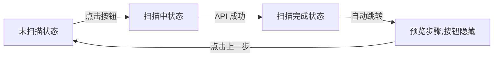

# SSH 配置导入向导 - 扫描按钮状态管理文档

**日期:** 2025-10-19  
**类型:** 功能说明 / 状态管理  
**状态:** ✅ 已完成

---

## 📋 按钮状态定义

### 三种状态

扫描按钮（`#startScanBtn`）具有三种明确的状态：

#### 1. **未扫描状态（默认状态）**
- **显示内容:** 🔍 开始自动扫描
- **按钮状态:** 启用（`disabled = false`）
- **视觉效果:** 蓝色渐变背景，可点击
- **触发时机:**
  - 首次打开弹窗
  - 从预览步骤返回到扫描步骤
  - 扫描完成后（虽然会被隐藏）

#### 2. **扫描中状态**
- **显示内容:** ⏳ 扫描中...（带旋转 spinner）
- **按钮状态:** 禁用（`disabled = true`）
- **视觉效果:** 
  - 半透明（`opacity: 0.8`）
  - 不可点击（`cursor: not-allowed`）
  - 白色 spinner 旋转动画
- **触发时机:**
  - 用户点击"开始自动扫描"按钮后
  - 正在执行扫描 API 调用期间

#### 3. **扫描完成状态**
- **显示内容:** 🔍 开始自动扫描（重置为默认）
- **按钮状态:** 启用（`disabled = false`）
- **显示状态:** 隐藏（`display: none`，由 `wizardState.hasScanned` 控制）
- **触发时机:**
  - 扫描 API 返回成功结果后
  - 自动跳转到预览步骤前的瞬间

---

## 🔄 状态转换流程

### 正常扫描流程



### 错误处理流程


---

## 🎨 按钮 HTML 结构变化

### 状态 1: 未扫描（默认）
```html
<button class="btn btn-primary btn-large" id="startScanBtn">
    <span>🔍</span>
    <span>开始自动扫描</span>
</button>
```

### 状态 2: 扫描中
```html
<button class="btn btn-primary btn-large is-scanning" id="startScanBtn" disabled>
    <span class="scan-spinner-lite" aria-hidden="true"></span>
    <span class="scan-btn-text">扫描中...</span>
</button>
```

### 状态 3: 扫描完成（隐藏前）
```html
<button class="btn btn-primary btn-large" id="startScanBtn" style="display: none;">
    <span>🔍</span>
    <span>开始自动扫描</span>
</button>
```

---

## 📝 关键函数

### 1. `handleStartScan()` - 处理扫描按钮点击

**职责:** 
- 防止重复点击
- 调用扫描 API
- 处理成功/失败结果

**状态变化:**
```javascript
未扫描状态 → showScanningStatus() → 扫描中状态
```

**代码片段:**
```javascript
async function handleStartScan() {
    if (scanInProgress) {
        showToast('⏳ 扫描正在进行中，请稍候...', 'info');
        return;
    }
    
    try {
        scanInProgress = true;
        showScanningStatus();  // 切换到扫描中状态
        
        const response = await fetch('/api/ssh-scan/scan-all', {...});
        const result = await response.json();
        
        if (result.success) {
            showScanResult(result.data);  // 切换到扫描完成状态
        }
    } catch (error) {
        hideScanningStatus();  // 恢复到未扫描状态
        showToast('❌ ' + error.message, 'error');
    } finally {
        scanInProgress = false;
    }
}
```

---

### 2. `showScanningStatus()` - 显示扫描中状态

**职责:**
- 更新按钮为"扫描中..."
- 禁用按钮
- 显示进度动画
- 隐藏扫描结果区域

**按钮状态变化:**
```javascript
// 禁用按钮并更新显示
scanBtn.disabled = true;
scanBtn.classList.add('is-scanning');
scanBtn.innerHTML = '<span class="scan-spinner-lite"></span><span class="scan-btn-text">扫描中...</span>';
```

**视觉效果:**
- ⏳ 白色旋转 spinner
- 半透明按钮
- 不可点击

---

### 3. `showScanResult()` - 显示扫描结果

**职责:**
- 隐藏扫描进度动画
- **重置按钮到默认状态**（关键修复）
- 填充扫描结果数据
- 设置 `hasScanned = true`
- 自动跳转到预览步骤

**按钮状态变化（已修复）:**
```javascript
// 恢复按钮到默认状态
scanBtn.disabled = false;
scanBtn.classList.remove('is-scanning');
scanBtn.innerHTML = '<span>🔍</span><span>开始自动扫描</span>';  // ✅ 新增
```

**注意:** 虽然按钮被重置为默认状态，但会在 1 秒后自动跳转到预览步骤，此时按钮会被隐藏（由 `wizardState.updateUI()` 控制）。

---

### 4. `hideScanningStatus()` - 隐藏扫描中状态

**职责:**
- 在扫描失败时调用
- 恢复按钮到默认状态
- 隐藏进度动画

**按钮状态变化:**
```javascript
scanBtn.disabled = false;
scanBtn.innerHTML = '<span>🔍</span><span>开始自动扫描</span>';
scanBtn.classList.remove('is-scanning');
```

**调用时机:**
- API 调用失败（catch 块）
- 网络错误
- 服务器返回错误

---

### 5. `switchBackToScanStep()` - 返回到扫描步骤

**职责:**
- 从预览步骤返回到扫描步骤
- **重置 `hasScanned` 标志**（允许重新扫描）
- 显示扫描按钮

**关键代码:**
```javascript
function switchBackToScanStep() {
    // 重置 hasScanned 标志，允许重新扫描
    wizardState.hasScanned = false;
    
    // 更新状态为扫描步骤
    wizardState.setStep(WizardStep.SCAN);
    // → 触发 updateUI() → 显示扫描按钮
}
```

---

## 🎨 CSS 样式定义

### Spinner 动画
```css
.scan-spinner-lite {
    display: inline-block;
    width: 14px;
    height: 14px;
    border: 2px solid rgba(255, 255, 255, 0.3);
    border-top-color: #fff;
    border-radius: 50%;
    animation: spin-lite 0.8s linear infinite;
    vertical-align: middle;
    margin-right: 6px;
}

@keyframes spin-lite {
    to { 
        transform: rotate(360deg); 
    }
}
```

### 扫描中状态样式
```css
#startScanBtn.is-scanning {
    cursor: not-allowed;
    opacity: 0.8;
}
```

---

## 🧪 测试用例

### 测试场景 1: 正常扫描流程
1. ✅ 打开弹窗 → 显示"🔍 开始自动扫描"
2. ✅ 点击按钮 → 显示"⏳ 扫描中..."（带动画）
3. ✅ 扫描成功 → 按钮重置为"🔍 开始自动扫描"（瞬间）
4. ✅ 自动跳转 → 按钮隐藏（预览步骤）

### 测试场景 2: 返回重新扫描
1. ✅ 预览步骤点击"上一步"
2. ✅ 返回扫描步骤 → 显示"🔍 开始自动扫描"
3. ✅ 可再次点击扫描

### 测试场景 3: 扫描失败
1. ✅ 点击扫描按钮 → 显示"⏳ 扫描中..."
2. ✅ API 返回错误 → 恢复"🔍 开始自动扫描"
3. ✅ 显示错误提示
4. ✅ 可立即重试

### 测试场景 4: 防止重复点击
1. ✅ 点击扫描按钮 → 进入扫描中状态
2. ✅ 快速再次点击 → 显示"扫描正在进行中"提示
3. ✅ 不会触发第二次 API 调用

---

## 🔍 问题修复历史

### 问题 1: 扫描完成后按钮文本未重置
**发现时间:** 2025-10-19  
**问题描述:** 扫描完成后按钮仍显示"扫描中..."  
**根本原因:** `showScanResult()` 函数中只移除了 `is-scanning` 类，但没有重置 `innerHTML`  
**修复方案:**
```javascript
// 旧代码
scanBtn.disabled = false;
scanBtn.classList.remove('is-scanning');

// 新代码
scanBtn.disabled = false;
scanBtn.classList.remove('is-scanning');
scanBtn.innerHTML = '<span>🔍</span><span>开始自动扫描</span>';  // ✅ 添加
```

### 问题 2: 从预览返回后按钮不显示
**发现时间:** 2025-10-19  
**问题描述:** 从预览步骤返回到扫描步骤后，按钮保持隐藏  
**根本原因:** `hasScanned` 标志没有在返回时重置  
**修复方案:** 在 `switchBackToScanStep()` 中添加 `wizardState.hasScanned = false`

---

## 📊 状态变量跟踪

### 全局变量
```javascript
let scanInProgress = false;  // 防止重复点击
```

### wizardState 对象
```javascript
wizardState = {
    hasScanned: false,  // 是否已完成首次扫描
    currentStep: WizardStep.SCAN,  // 当前步骤
    // ...
}
```

### 按钮属性
```javascript
scanBtn.disabled  // true/false - 是否禁用
scanBtn.classList.contains('is-scanning')  // true/false - 是否在扫描中
scanBtn.style.display  // 'inline-flex'/'none' - 是否显示
```

---

## 🎯 设计原则

1. **状态明确:** 任何时刻按钮都处于三种状态之一
2. **视觉反馈:** 每种状态都有清晰的视觉表现
3. **防御性编程:** 防止重复点击、空指针等边界情况
4. **用户友好:** 错误时可立即重试，成功时自动跳转
5. **一致性:** 所有状态转换都通过统一的函数管理

---

## 🔗 相关文件

- **HTML:** `src/main/resources/templates/fragments/ssh-config-import-wizard.html`
- **JavaScript:** `src/main/resources/templates/main-layout.html` (行 4313-4520)
- **CSS:** `src/main/resources/static/css/ssh-config-import-wizard.css` (行 1883-1925)

---

## 📝 维护清单

### 修改按钮文本时
- [ ] 更新 `showScanningStatus()` 中的 innerHTML
- [ ] 更新 `showScanResult()` 中的重置 innerHTML
- [ ] 更新 `hideScanningStatus()` 中的重置 innerHTML

### 添加新状态时
- [ ] 在状态定义部分添加说明
- [ ] 更新状态转换流程图
- [ ] 添加对应的 CSS 样式
- [ ] 添加测试用例

---

**签名:** GitHub Copilot  
**审核:** 待用户验证  
**版本:** 1.0
