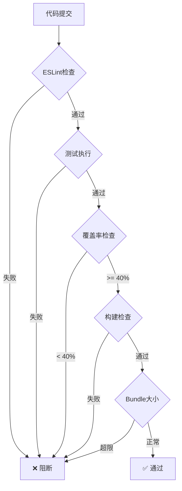

# 质量标准与验收规范

**文档版本**: v1.0
**创建日期**: 2025-10-12
**适用项目**: Dev Debug Platform

---

## 📋 目录

1. [代码质量标准](#代码质量标准)
2. [测试覆盖率要求](#测试覆盖率要求)
3. [构建产物标准](#构建产物标准)
4. [CI/CD质量门禁](#cicd质量门禁)
5. [代码审查标准](#代码审查标准)
6. [发布验收标准](#发布验收标准)

---

## 🎯 代码质量标准

### 前端代码规范

#### TypeScript规范
- ✅ 严格模式启用（`"strict": true`）
- ✅ 显式类型声明（避免`any`，使用`unknown`）
- ✅ 接口优先于类型别名（公共API）
- ✅ 枚举使用`const enum`（除非需要反向映射）
- ✅ 函数返回值必须声明类型
- ✅ 避免使用`!`非空断言（除非确定安全）

**示例**:
```typescript
// ✅ Good
interface ServerConfig {
  host: string;
  port: number;
  timeout?: number;
}

function fetchServer(id: number): Promise<ServerConfig> {
  // implementation
}

// ❌ Bad
function fetchServer(id: any): any {
  // implementation
}
```

#### 代码风格
- **缩进**: 4空格（TypeScript）
- **字符串**: 双引号`"`
- **分号**: 必须使用
- **命名规范**:
  - 类名: PascalCase (`ServerDetailOverlay`)
  - 函数/变量: camelCase (`fetchServerData`)
  - 常量: UPPER_SNAKE_CASE (`MAX_RETRY_COUNT`)
  - 私有成员: 前缀`_`或private关键字

#### ESLint规则
必须通过的规则：
- `no-unused-vars`: error
- `no-console`: warning（生产环境error）
- `@typescript-eslint/no-explicit-any`: error
- `@typescript-eslint/explicit-function-return-type`: warning

### CSS/样式规范

#### Stylelint规则
- ✅ 遵循BEM命名规范（推荐）
- ✅ 使用CSS变量（设计令牌）
- ✅ 避免`!important`（除非覆盖第三方库）
- ✅ 颜色使用设计令牌变量
- ✅ 移动优先响应式设计

**示例**:
```css
/* ✅ Good */
.server-card {
  background: var(--color-surface);
  padding: var(--spacing-md);
  border-radius: var(--radius-md);
}

.server-card__title {
  color: var(--color-text-primary);
  font-size: var(--font-size-lg);
}

/* ❌ Bad */
.serverCard {
  background: #ffffff !important;
  padding: 16px;
}
```

---

## 📊 测试覆盖率要求

### 覆盖率目标

| 阶段 | 最低要求 | 目标 | 优秀 |
|------|---------|------|------|
| **当前（2025-10）** | 40% | 60% | 70% |
| **2025-11** | 50% | 70% | 80% |
| **2025-12+** | 60% | 80% | 90% |

### 分类覆盖率要求

| 代码类型 | 最低覆盖率 | 说明 |
|----------|-----------|------|
| **工具函数** | 90% | format.ts, i18n.ts等 |
| **业务逻辑** | 70% | dashboard.ts, server-modal.ts |
| **UI组件** | 60% | 交互密集的组件 |
| **配置文件** | 可选 | vite.config.ts等 |

### 测试类型要求

#### 单元测试
- ✅ 每个公共函数必须有测试
- ✅ 边界条件测试（null、undefined、空值）
- ✅ 错误处理测试
- ✅ 异步函数的成功和失败场景

**示例**:
```typescript
describe('formatBytes', () => {
  it('should format bytes to human readable', () => {
    expect(formatBytes(1024)).toBe('1.00 KB');
    expect(formatBytes(1048576)).toBe('1.00 MB');
  });

  it('should handle zero bytes', () => {
    expect(formatBytes(0)).toBe('0 Bytes');
  });

  it('should handle null/undefined', () => {
    expect(formatBytes(null)).toBe('0 Bytes');
    expect(formatBytes(undefined)).toBe('0 Bytes');
  });
});
```

#### 集成测试
- ✅ 关键业务流程必须覆盖
- ✅ API交互测试（mock）
- ✅ 状态管理测试

#### E2E测试（可选）
- 关键用户路径（登录、仪表板、服务器管理）

---

## 📦 构建产物标准

### Bundle大小限制

| 文件 | 最大大小 | 警告阈值 | 说明 |
|------|---------|---------|------|
| **main.js** | 300 KB | 280 KB | 主入口文件 |
| **main-legacy.js** | 320 KB | 300 KB | 兼容版本 |
| **main.css** | 10 KB | 8 KB | 主样式文件 |
| **总计（gzip后）** | 100 KB | 90 KB | 所有资源 |

### Bundle优化要求
- ✅ Tree Shaking已启用
- ✅ 代码分割（Code Splitting）
- ✅ 懒加载（Lazy Loading）非关键模块
- ✅ 第三方库按需引入
- ✅ 移除dead code和console.log

### 性能指标

| 指标 | 目标值 | 说明 |
|------|-------|------|
| **首次内容绘制(FCP)** | < 1.5s | |
| **最大内容绘制(LCP)** | < 2.5s | |
| **首次输入延迟(FID)** | < 100ms | |
| **累积布局偏移(CLS)** | < 0.1 | |

---

## 🚦 CI/CD质量门禁

### 必须通过的检查

#### 1. 代码质量检查（阻断式）
```yaml
✅ ESLint无error（warning允许）
✅ Stylelint无error
✅ TypeScript编译成功
✅ Prettier格式检查通过
```

#### 2. 测试检查（阻断式）
```yaml
✅ 所有单元测试通过（0 failed）
✅ 测试覆盖率 >= 最低要求（当前40%）
✅ 无跳过的测试（test.skip/test.todo必须注释说明）
```

#### 3. 构建检查（阻断式）
```yaml
✅ 前端构建成功（npm run build）
✅ 后端构建成功（mvn verify）
✅ Bundle大小 < 最大限制
✅ 无构建警告（warning需review）
```

#### 4. 安全检查（警告式）
```yaml
⚠️ npm audit无critical漏洞
⚠️ npm audit无high漏洞
📝 moderate漏洞需要issue跟踪
```

### 质量门禁流程



---

## 👀 代码审查标准

### 必须审查的内容

#### 1. 架构和设计
- [ ] 是否符合现有架构模式
- [ ] 是否引入不必要的依赖
- [ ] 是否有更好的设计方案
- [ ] 是否影响性能

#### 2. 代码质量
- [ ] 命名清晰易懂
- [ ] 函数职责单一
- [ ] 避免重复代码（DRY原则）
- [ ] 注释充分（复杂逻辑必须注释）
- [ ] 错误处理完善

#### 3. 测试
- [ ] 新功能有对应测试
- [ ] 修改的代码有回归测试
- [ ] 测试覆盖边界条件
- [ ] 测试可读性强

#### 4. 文档
- [ ] README更新（如需）
- [ ] API文档更新（如需）
- [ ] 变更说明清晰
- [ ] 技术决策有记录

### Code Review Checklist

**提交者必填**:
```markdown
## 变更说明
- [ ] 我已测试过此变更
- [ ] 我已添加/更新了测试
- [ ] 我已更新了相关文档
- [ ] 我已运行lint和format
- [ ] CI检查全部通过

## 影响范围
- 影响模块：
- 是否破坏性变更：是/否
- 是否需要数据库迁移：是/否
```

**审查者检查**:
```markdown
- [ ] 代码逻辑正确
- [ ] 测试充分
- [ ] 性能影响可接受
- [ ] 安全风险已评估
- [ ] 文档完整
```

---

## 🚀 发布验收标准

### 版本发布前检查

#### 1. 功能验收
- [ ] 所有计划功能已实现
- [ ] 功能demo可正常演示
- [ ] 用户文档已更新
- [ ] Release Notes已准备

#### 2. 质量验收
- [ ] 所有CI检查通过
- [ ] 测试覆盖率达标
- [ ] 无已知P0/P1 bug
- [ ] 性能指标达标

#### 3. 安全验收
- [ ] 依赖安全审计通过
- [ ] 代码安全扫描通过
- [ ] 敏感信息检查
- [ ] HTTPS配置正确

#### 4. 部署验收
- [ ] 构建产物验证
- [ ] 回滚方案准备
- [ ] 监控告警配置
- [ ] 备份计划执行

### 发布等级

| 等级 | 说明 | 验收要求 |
|------|------|---------|
| **P0 - Hotfix** | 紧急修复 | 最小验证 + 快速回归 |
| **P1 - Minor** | 小版本 | 完整CI + 功能测试 |
| **P2 - Major** | 大版本 | 全部标准 + E2E测试 |

---

## 📈 质量指标跟踪

### 每周跟踪指标

| 指标 | 当前值 | 目标值 | 趋势 |
|------|--------|--------|------|
| 测试覆盖率 | 43.97% | 60% | 📈 |
| Bundle大小(main.js) | 261KB | <280KB | ✅ |
| CI通过率 | - | >95% | - |
| 平均修复时间 | - | <2天 | - |
| 代码重复率 | - | <5% | - |

### 质量改进计划

**短期（1个月）**:
- [ ] 测试覆盖率提升到60%
- [ ] 添加Bundle大小监控
- [ ] 建立CI/CD流程

**中期（3个月）**:
- [ ] 测试覆盖率提升到80%
- [ ] 性能监控系统
- [ ] 自动化E2E测试

**长期（6个月）**:
- [ ] 代码质量A级
- [ ] 零Critical漏洞
- [ ] 完整的质量度量体系

---

## 📞 支持与反馈

### 质量问题上报
- **渠道**: GitHub Issues
- **标签**: `quality`, `bug`, `performance`
- **响应时间**: 24小时内

### 标准更新
- **责任人**: 技术负责人
- **更新频率**: 季度review
- **变更流程**: 团队讨论 → 文档更新 → 全员通知

---

**文档维护**: 技术团队
**最后更新**: 2025-10-12
**版本**: v1.0
